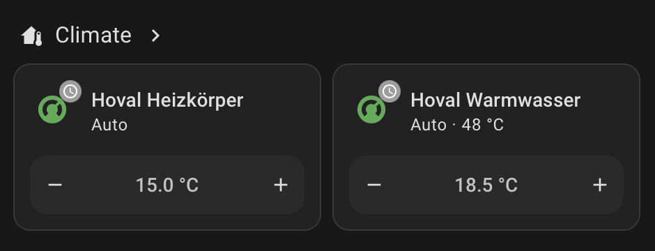
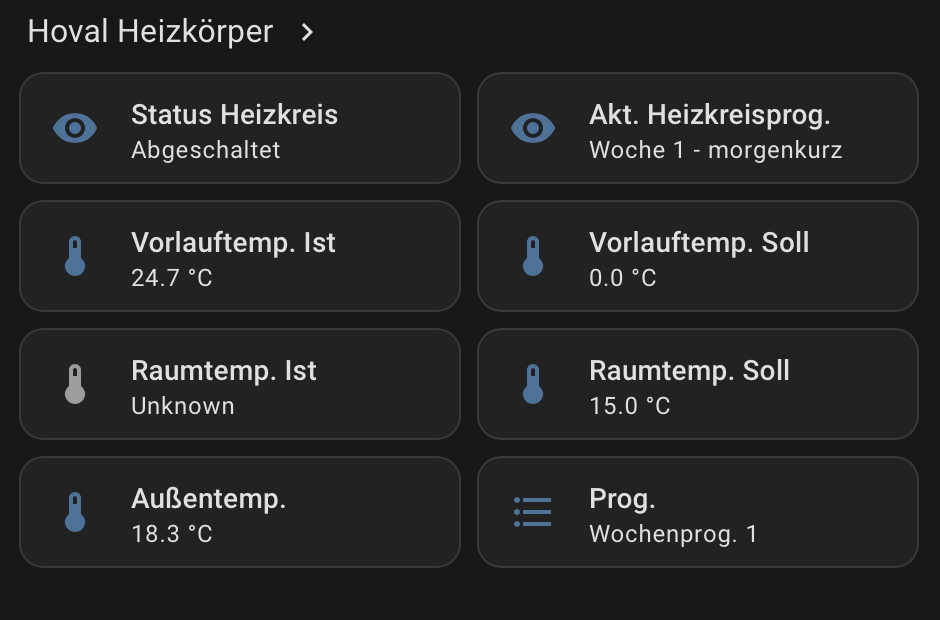
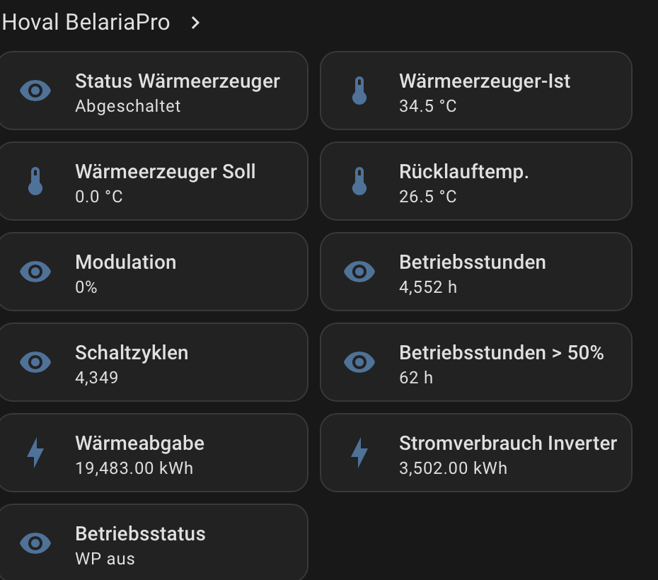
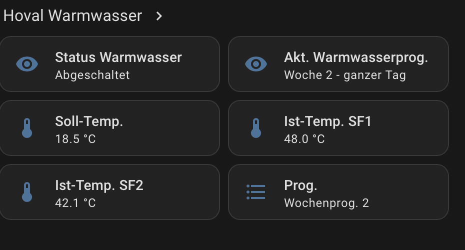

# Hoval Connect App

This app installs the bundled Hoval Connect custom integration into the Home Assistant configuration directory. It is an alternative installation path for users who previously installed Hoval Connect via HACS or by manually copying files; the integration code remains available under `custom_components/hovalconnect` for HACS users.

## Configuration

| Option | Default | Description |
| --- | --- | --- |
| `backup_existing` | `true` | Copies any existing `/config/custom_components/hovalconnect` directory to a timestamped backup before installing this version. |

## Usage

1. Add this app repository to Home Assistant:

   ```text
   https://github.com/chrisunderscorek/hovalconnect-ha
   ```

2. Install **Hoval Connect**.
3. Start the app once.
4. Restart Home Assistant Core.
5. Add **Hoval Connect** from **Settings > Devices & services**.
6. Sign in with your HovalConnect email and password.
7. Select the integration language: **System**, **Deutsch**, or **English**.

The app exits after copying the integration files. Start it again whenever you want to update the installed integration from the app image.

Important update detail: the Home Assistant **Update** action updates only the
app image. Because this app is a one-shot installer, the updated integration is
not copied to `/config/custom_components/hovalconnect` until you start the app
again. The manual update flow is therefore:

1. Update **Hoval Connect** in Home Assistant.
2. Start **Hoval Connect** once.
3. Check the app log for `Installed Hoval Connect integration <version>`.
4. Restart Home Assistant Core.

The integration language affects only Hoval Connect entity names and prog. labels. It can be changed later from **Settings > Devices & services > Hoval Connect > Configure** without changing the global Home Assistant language. German and English names follow the official HovalConnect app wording where known, including `Wärmeerzeuger-Ist`, `Vorlauftemp. Ist`, `Ist-Temp. SF1`, `Ist-Temp. SF2`, `Heat generator actual`, and `Flow temp. actual`.

Readout, device grouping, localization, energy counters, and status mapping are the actively tested parts of this integration. Write support for target temperatures and program selection is planned but has not been practically tested on the supported Belaria setup yet. The control entities are already present in Home Assistant, but writes should not be treated as a supported `1.0.0` feature.

The integration stores OAuth token data after setup. Email and password are only stored if you enable **Store email and password permanently** in the integration setup or re-authentication flow; otherwise Home Assistant will ask you to re-authenticate when the saved token can no longer be renewed. Token renewal is first attempted after half of the effective token lifetime. Failed renewal attempts are retried while the current token remains valid with a staged backoff: 3 attempts after 10 seconds, 3 attempts after 30 seconds, 3 attempts after 60 seconds, then every 120 seconds. If the token endpoint sends `Retry-After`, the integration waits at least that long.

Energy counters for heat output and inverter energy use are exposed as Home Assistant `kWh` energy sensors. Hoval's cloud live values are converted from values that behave like `MWh` to `kWh`; the original raw value and inferred raw unit remain visible as sensor attributes.

The WFA-200 operating status sensor uses the WFA-200 status table, for example `0` becomes `WP aus` in German and `Heat pump off` in English. If the live-values response does not include `faStatus`, the integration falls back to the read-only business circuit detail datapoint `*.2053`.

## Screenshots

Example Home Assistant device view with German labels:

| Temperature cards | Heating circuit |
| --- | --- |
|  |  |

| Heat pump / heat generator | Hot water |
| --- | --- |
|  |  |

## Network and Security

The app ships with a custom AppArmor profile. It grants write access only to the Home Assistant custom integration path and allows outbound TCP/DNS networking. The installed integration itself runs inside Home Assistant Core and uses HTTPS to reach the Hoval cloud API.
